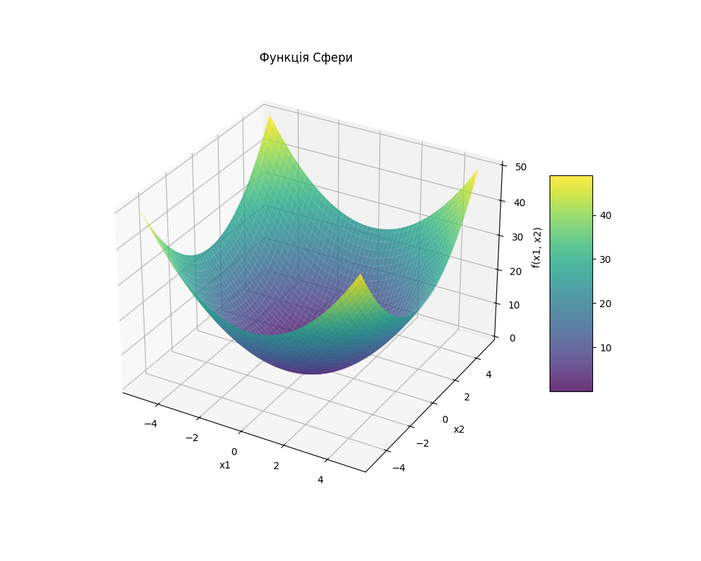

# Homework on "Local Search, Heuristics, and Simulated Annealing"

Welcome! 🧠

Today, you will practice using three different local optimization approaches to minimize the Sphere function: Hill Climbing, Random Local Search, and Simulated Annealing.

You will learn the principles behind these algorithms, including how to configure parameters such as the number of iterations, sensitivity to improvements (epsilon), and temperature scheduling (for simulated annealing).

This assignment will help you understand the differences between these methods, their strengths and weaknesses, and evaluate their effectiveness in finding approximate minima in a multidimensional space.

Let's get started! 💪🏼

## Solution




## Task Description

Implement a program to minimize the Sphere function:

$f(x) = \sum_{i=1}^n x_i^2$

using three different local optimization approaches:

1. Hill Climbing Algorithm
2. Random Local Search
3. Simulated Annealing

# Technical Requirements

The function domain is defined as:

1. The function domain is defined as:

$x_i \in [-5, 5]$

for each parameter $x_i$

2. The algorithms must return:

- The optimal point (a list of coordinates $x$).
- The function value at that point.

3. Implement three optimization methods:

- hill_climbing — Hill Climbing algorithm.
- random_local_search — Random Local Search.
- simulated_annealing — Simulated Annealing.

4. Each algorithm must accept a parameter `iterations`, which defines the maximum number of iterations for execution.

5. Algorithms should terminate based on one of the following conditions:

- The change in the objective function value or the position in the solution space between two consecutive iterations becomes smaller than `epsilon`. Epsilon is a precision parameter that determines the algorithm's sensitivity to minor improvements.
- For the Simulated Annealing algorithm, the temperature should be considered: if the temperature decreases below `epsilon`, the algorithm should terminate, as this indicates the search capability is exhausted.

Acceptance Criteria
📌 Meeting these criteria is mandatory for mentor review. If any criterion is not met, the mentor will return the homework for revision without evaluation. If you need clarification 😉 or get stuck at any step, feel free to ask your mentor in Slack.

- The algorithms operate within the given range $x_i \in [-5, 5]$
- The program approximates the global minimum of the function.
- The results of all three algorithms are presented in a clear and readable format.

Program Template:

```python
import random
import math


# Define the Sphere function
def sphere_function(x):
    return sum(xi ** 2 for xi in x)


# Hill Climbing
def hill_climbing(func, bounds, iterations=1000, epsilon=1e-6):
    pass


# Random Local Search
def random_local_search(func, bounds, iterations=1000, epsilon=1e-6):
    pass


# Simulated Annealing
def simulated_annealing(func, bounds, iterations=1000, temp=1000, cooling_rate=0.95, epsilon=1e-6):
    pass


if __name__ == "__main__":
    # Define function bounds
    bounds = [(-5, 5), (-5, 5)]

    # Execute algorithms
    print("Hill Climbing:")
    hc_solution, hc_value = hill_climbing(sphere_function, bounds)
    print("Solution:", hc_solution, "Value:", hc_value)

    print("\nRandom Local Search:")
    rls_solution, rls_value = random_local_search(sphere_function, bounds)
    print("Solution:", rls_solution, "Value:", rls_value)

    print("\nSimulated Annealing:")
    sa_solution, sa_value = simulated_annealing(sphere_function, bounds)
    print("Solution:", sa_solution, "Value:", sa_value)
```

Example of execution

```python
Hill Climbing:
Solution: [0.0005376968388007969, 0.0007843237077809137] Value: 9.042815690435702e-07

Random Local Search:
Solution: [0.030871215407484165, 0.10545563391334589] Value: 0.012073922664800917

Simulated Annealing:
Solution: [0.024585173708439823, -0.00484719941675793] Value: 0.0006279261084599791
```
